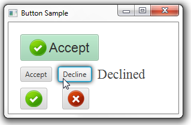
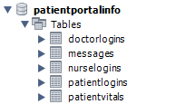
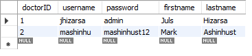
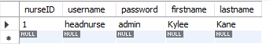
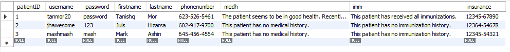
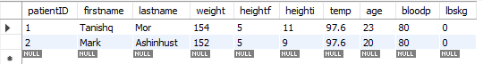
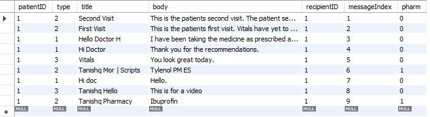

# Patient Portal

---

About: This program was developed to be used within the current medical operating environment. By interpreting the types of interactions between patients, nurses and doctors, one can choose actions based on their role. There are three main roles which represent the three main **actors** of this program. Below will describe the main functionality of thise code and how it can be used as well as a descriptive guide on how to get it running yourself.

## Table of Contents

---

1. Dependencies and Coding Language
2. Database Design
3. Structure of the Program
4. Where to get Started
5. Program in Action
6. Meet the Team

## Dependencies and Coding Language

---

The Patient Portal program was coded in Fall of 2021 and was coded in Java using JavaFX and Java FXML. Java is a versitile language and supports graphical user interfaces and computations between backend code and the front end user view.

Java FXML contains the XML formatted code that displays information to the user. This information is the shell of the program and where the users (actors) can input and manipulate their information.

A good understanding of Java methods including Iterators and certain behavioral characteristics including oververs allow the user to gather a better understanding of what is happening. An observer subscribes to an action and is notified when something happens. This occurs between all of the ActionEvents that occur in these Java methods and controller classes. i.e Notified to change the input text-box once this button is clicked.

Not only are these buttons used, but a variety of these Java elements. A short but not complete list includes, TextAreas, TextFields, PasswordFields, Buttons, ComboBoxes and many more.

All of these elements work together and interact with one another to develop a complete working program.

To run this program, the user must have JavaFX and FXML capabilities. Knowledge and understanding those modules and respective methods will explain how the program functions.

## Database Design

---

This is the first implementation of the overall program. MySQL server was used with this program to house all of the information of the actors as well as communication between them and the pharmacy. The MySQL database was created on a local server to house the information and incorporates information hiding and data/method abstractions to hold data points.

This server as previously mentioned is held locally. Therefore, the database cannot be accessed outside of what was made for this program. To use the demonstration database, one can copy the `.sql` files that are included in the main PatientPortal folder containing all the code.

The general structure of the database schema consists of five tables, each with their own primary keys and some reuse of foreign keys. The tables are as follows...

1. doctorlogins
2. nurselogins
3. patientlogins
4. patientvitals
5. messages

- These are not always located in this order, however, this is the order in which they are going to be explained.

### doctorlogins Table

This is the table that holds all of the doctor information. Doctors are not allowed to create their own accounts and their information is manually added to the database by administration. The fields that are stored here contain the information about the doctors as well as their login information.

The username and password fields correspond to what will be used in the program.

### nurselogins Table

This is the table that contains all of the nurse information and is analogous to the doctor design. The nurse cannot create an account and only accounts are input into this database from administration. The fields that are stored contain the information about the nurse as well as their login information.

The username and password fields correspond to what will be used in the program.

### patientlogins Table

The main difference between the patient login table compared to the other tables is the patient can create accounts. This means that the table will be continuously updated during runtime to compensate for any new account creations. This is the first dynamic table used in the program and contains a plethora of information about such patients. This table contains a multitude of fields including...

| patientID | username | password | firstname | lastname | phonenumber | medical history | immunization history | insurance number |
| :-------- | :------- | :------- | :-------- | :------- | :---------- | :-------------- | :------------------- | ---------------- |

Not only can all these new fields be created for each new patient, but they can also be updated per the nurse and doctor who can change this patients medical history and immunization history.

### patientvitals Table

This is a table that is based off of the patientlogins table. This table was created under the impression that searching and updated information would be shortened by the created normalization. This normalization refers to the reduction of redundant information about which patient corresponds to what information. The foreign key that is used by the patient vitals table is the patientID which is used as the unique identifier for the patient.

This table of information is maintained by the nurse who can manipulate and iterate through all of the vital information for each patient as well as creating vital information for patients that do not yet exist.

### messages Table

This is the final table that is used within the program is one that is used by all three actors within the program usage. The doctors, nurses and patients can all create messages that go between themselves as well as the pharmacy. The pharmacy, however, can only be contacted by a doctor which is defined in their set of operations.

Messages uses a foreign key to denote which patient, doctor, nurse sent the message and which patient, doctor, nurse the message is being sent to. In addition to this field, there is another field with the name `type`. This field pertains to which type of message this is for. A message from a patient is denoted with the type of 1, a doctor with 2 and a nurse being type 3. The title and body are fields as well as a counter of how many messages are stored. Lastly, the field of pharm is used to denote whether or not a message is intended for a pharmacy. This INT field is used as a boolean with 0 meaning it is not and 1 meaning that it is meant for a pharmacy. Additionally, only messages of type 2 should be allowed to have a field value of 1 for pharm (only doctors can send messages meant for the pharmacy). Examples can be seen below.

This concludes the general breakdown and structure of the database setup and table structures.

## Structure of the Program

---

The structure of the program will be described in a layered sense of architecture. Each layer is going to move through that part of the architecture and describe which actors and which methods are to be invoked on each layer. The interactions between the user and the layer of that program determine what happens next. These interactions are best expressed in a sequence diagram, however, they will be explained here in words.

The first opening screen of the program presents the user with three options. The three options are to login to the application as a patient, nurse or doctor.

### Logging in as a Doctor

Logging in as a doctor is quite simple and works like most other login applications. There is no ability for a doctor to request their username and password login information. If they forgot it, they must speak with their administration themselves.

To login, the doctor must correctly identify their username and password. If it is wrong, they will be notified and cannot login.

Once the user provides a correct password, they will be allowed into the main doctor account page. From here the doctor can access patient vital information as well as any messages that were sent to the doctor from the patient.

The range of actions of the doctor, other than viewing information, is to submit some messages of their own either to the patient they are viewing or to the pharmacy describing which medicine this patient requires.

All of this information is updated to the MySQL database and is placed in the various fields. The title and body of the messages are input as well as the current patient and whether or not the information/message will be going to the pharmacy or the patient themselves.

Lastly, and this is available for each actor within the system, they are given the accesibility to the help page in the program. This page will redirect the actor to this github repository where they can read this and learn how to use the program at any time.

### Logging in as a Nurse

Logging in as a Nurse... TDW
